Plugin zum Abrufen von Informationen von Wetterstationen
Netatmo.

# Plugin Konfiguration

Sobald das Plugin installiert ist, müssen Sie Ihre Informationen eingeben
Netatmo-Verbindung :

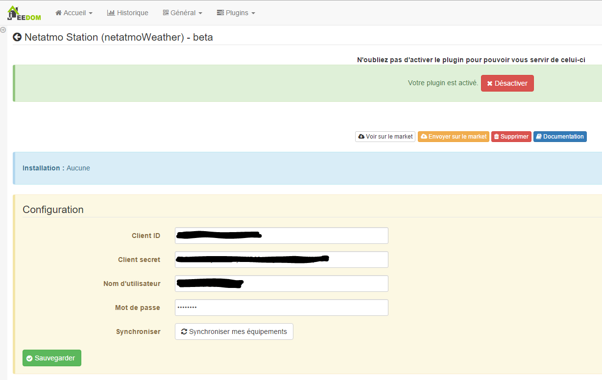

-   **Kunden-ID** : Ihre Client-ID (siehe Konfigurationsabschnitt)

-   **Geheimer Kunde** : Ihr geheimer Client (siehe Konfigurationsabschnitt)

-   **Benutzername** : Benutzername Ihres Netatmo-Kontos

-   **Passwort** : Passwort für Ihr Netatmo-Konto

-   **Synchroniser** : ermöglicht es Ihnen, Jeedom mit Ihrem Konto zu synchronisieren
    Netamo, um Ihre Netamo-Geräte automatisch zu erkennen. A.
    tun, nachdem Sie die vorherigen Einstellungen gespeichert haben.

# Verbindungsinformationen abrufen

Um Ihre Station zu integrieren, müssen Sie einen Client\_id und einen haben
client\_secret généré sur le site <http://dev.netatmo.com>.

Klicken Sie einmal auf Start :

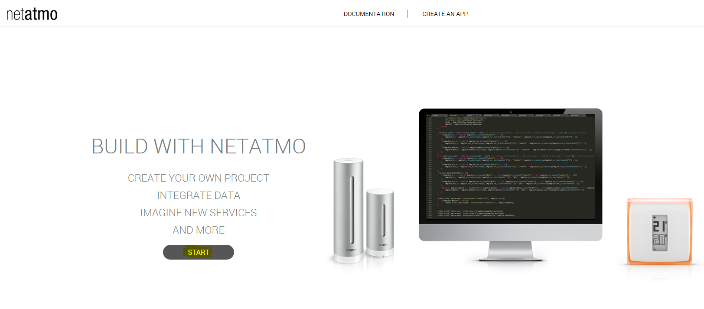

Dann auf "App erstellen"

Identifizieren Sie sich mit Ihrer E-Mail-Adresse und Ihrem Passwort

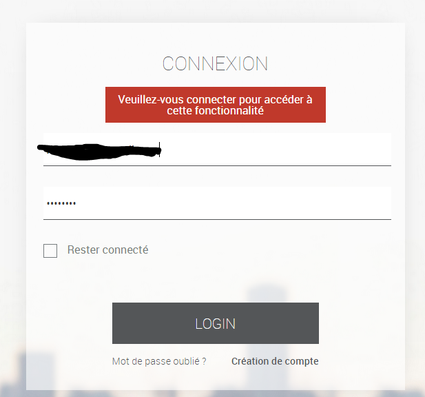

Füllen Sie die Felder "Name" und "Beschreibung" aus (was auch immer Sie wollen
es ist egal) :

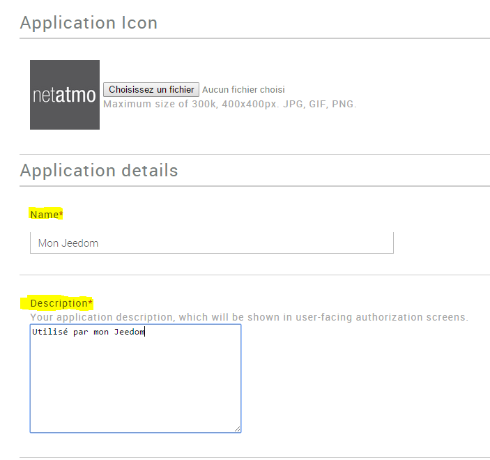

Aktivieren Sie dann unten auf der Seite das Kontrollkästchen "Ich akzeptiere die Nutzungsbedingungen"
Klicken Sie dann auf "Erstellen"

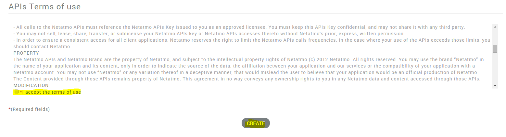

Rufen Sie die Informationen "CLient ID" und "Secret Client" ab und kopieren Sie die
im Konfigurationsteil des Plugins in Jeedom (siehe Kapitel
vorherige)

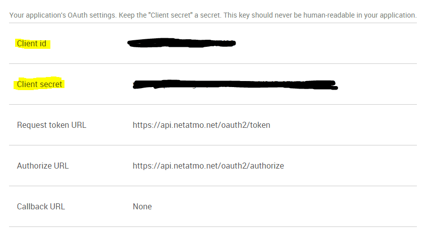

> **Important**
>
> Bitte beachten Sie, dass die Rückruf-URL "Keine" sein muss, andernfalls nicht
> wird nicht funktionieren.

# Gerätekonfiguration

Die Konfiguration der Netatmo-Ausrüstung ist über das Menü zugänglich
Plugin :

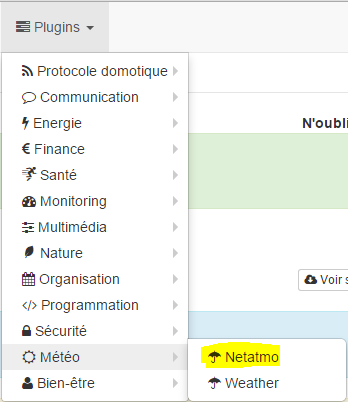

So sieht die Netatmo-Plugin-Seite aus (hier mit bereits 2
Ausrüstung) :

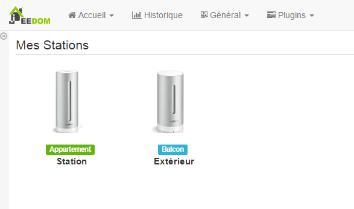

> **Tip**
>
> Platzieren Sie wie an vielen Stellen in Jeedom die Maus ganz links
> ruft ein Schnellzugriffsmenü auf (Sie können
> von deinem Profil immer sichtbar lassen).

Sobald Sie auf ein Gerät klicken, erhalten Sie :

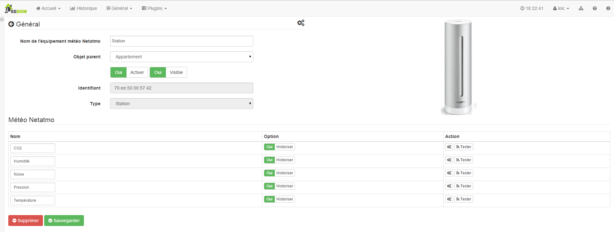

Hier finden Sie die gesamte Konfiguration Ihrer Geräte :

-   **Name des Netatmo-Geräts** : Name Ihrer Netatmo-Ausrüstung

-   **Übergeordnetes Objekt** : gibt das übergeordnete Objekt an, zu dem es gehört
    Ausrüstung

-   **Activer** : macht Ihre Ausrüstung aktiv

-   **Visible** : macht es auf dem Dashboard sichtbar

-   **Identifiant** : eindeutige Gerätekennung

-   **Type** : Art Ihrer Ausrüstung (Station, Innensonde,
    Außensonde…)

Nachfolgend finden Sie die Liste der Bestellungen :

-   Der im Dashboard angezeigte Name

-   Chronik : ermöglicht das Historisieren der Daten

-   erweiterte Konfiguration (kleine gekerbte Räder) : Anzeigen
    die erweiterte Konfiguration des Befehls (Methode
    Geschichte, Widget…)

-   Test : Wird zum Testen des Befehls verwendet

# Widget

Hier ist das Standard-Widget für eine Station im Dashboard :

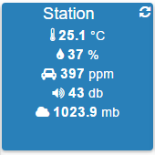

Und auf dem Handy :

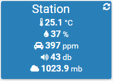

# FAQ

>**Was ist die Bildwiederholfrequenz? ?**
>
>Das System ruft alle 15 Minuten Informationen ab.

>**Ich habe meine Sonden, aber keinen Wert, der zurückgeht**
>
>Dies tritt auf, wenn ein Problem bei der Aktualisierung von Modulen oder Netatmo aufgeführt ist. Der einfachste Weg ist, ein Modul hinzuzufügen / zu entfernen. Um den Vorgang zu verfolgen, wird eine Aktualisierung aller Elemente erzwungen und das Problem sollte behoben werden.
