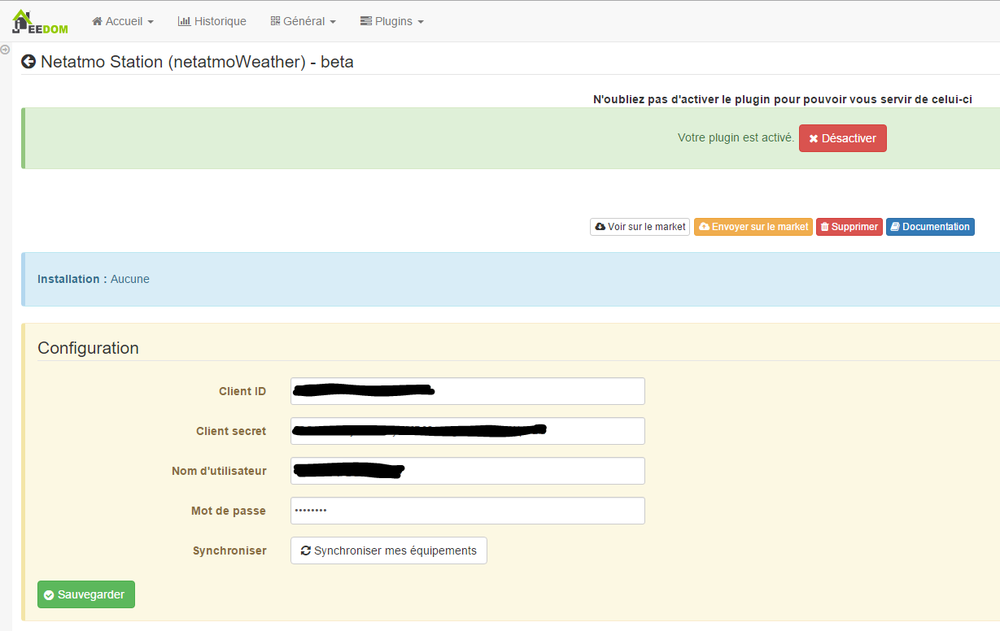
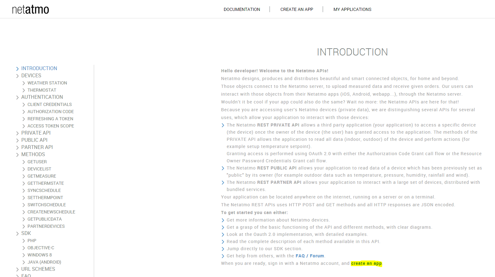
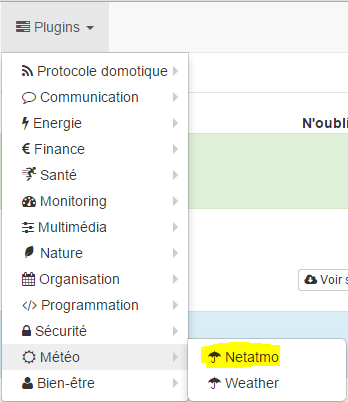
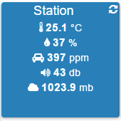

Plugin to retrieve information from weather stations
Netatmo.

# Plugin configuration

Once the Plugin is installed, you need to fill in your information
Netatmo connection :

-   **Client ID** : your client ID (see configuration section)

-   **Client secret** : your secret client (see configuration section)

-   **Username** : username of your netatmo account

-   **Password** : password for your Netatmo account

-   **Synchroniser** : allows you to synchronize Jeedom with your account
    Netamo to automatically discover your Netamo equipment. AT
    do after saving the previous settings.

# Retrieving connection information

To integrate your station, you must have a client\_id and a
client\_secret généré sur le site <http://dev.netatmo.com>.

Once on click on start :

Then on "create an app"

Identify yourself, with your email and password

Fill in the "Name" and "Description" fields (whatever you want
put it doesn't matter) :

Then at the bottom of the page check the box "I accept the terms of use"
then click on "Create"

Retrieve the "CLient id" and "Secret client" information and copy the
in the configuration part of the Plugin in Jeedom (see chapter
previous)

> **Important**
>
> Please note that the callback url must be "None" otherwise it does not
> will not work.

# Equipment configuration

The configuration of Netatmo equipment is accessible from the menu
Plugin :

This is what the Netatmo Plugin page looks like (here with already 2
equipment) :

> **Tip**
>
> As in many places on Jeedom, place the mouse on the far left
> brings up a quick access menu (you can
> from your profile always leave it visible).

Once you click on a piece of equipment you get :

Here you find all the configuration of your equipment :

-   **Name of the Netatmo device** : name of your Netatmo equipment

-   **Parent object** : indicates the parent object to which belongs
    equipment

-   **Activer** : makes your equipment active

-   **Visible** : makes it visible on the dashboard

-   **Identifiant** : unique equipment identifier

-   **Type** : type of your equipment (station, indoor probe,
    outdoor probe…)

Below you find the list of orders :

-   the name displayed on the dashboard

-   Historize : allows to historize the data

-   advanced configuration (small notched wheels) : Displays
    the advanced configuration of the command (method
    history, widget…)

-   Test : Used to test the command

# Widget

Here is the standard widget for a station on the dashboard :

And on mobile :

# FAQ

>**What is the refresh rate ?**
>
>The system retrieves information every 15 min.

>**I have my probes but no value that goes back**
>
>It happens when there is a problem listed update on modules or Netatmo. The easiest way is to Add / Remove a module and to follow the process it will force an update of everything and should correct the problem.
