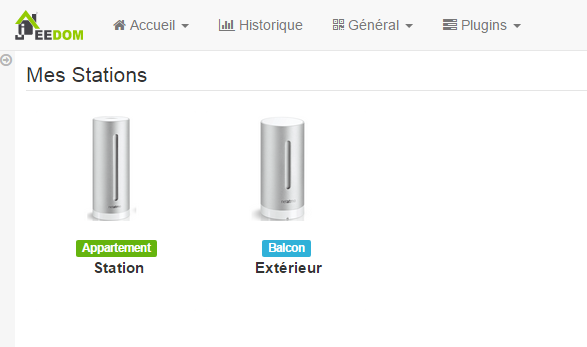

.

# Configuración del Plugin

 :

-   **ID del cliente** : 

-   **Client secret** : 

-   **Nombre de usuario** : 

-   **Contraseña** : 

-   **Sincronizar** : 
    
    .

# 

:>.

 :

"

 :

"
"

> **Importante**
>
> 
> .

# Configuración del equipo

Plugin :

equipos) :

> **Punta**
>
> Como en muchos lugares de Jeedom, coloca el mouse en el extremo izquierdo
> abre un menú de acceso rápido (puedes
> desde tu perfil siempre déjalo visible).

 :

Aquí encontrarás toda la configuración de tu equipo :

-   **** : 

-   **Objeto padre** : indica el objeto padre al que pertenece
    equipo

-   **Activar** : activa su equipo

-   **Visible** : lo hace visible en el tablero

-   **Identificador** : 

-   **Puntao** : ,
    

A continuación encontrará la lista de pedidos. :

-   el nombre que se muestra en el tablero

-   Guardar historial : permite historizar los datos

-   configuración avanzada (ruedas con muescas pequeñas) : Muestra
    La configuración avanzada del comando (método
    historia, widget ...)

-   Probar : Se usa para probar el comando

# Reproductor

 :

 :

# Preguntas frecuentes

>** ?**
>
>.

>****
>
>. .
