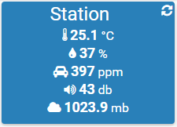

.

# Configuração do 

 :

-   **** : 

-   **** : 

-   **Nome de Usuário** : 

-   **Senha** : 

-   **Sincronizar** : 
    
    .

# 

:>.

 :

"

 :

"
"

> ****
>
> 
> .

# 

 :

 :

> ****
>
> 
> 
> .

 :

 :

-   **** : 

-   **Objeto pai** : 
    

-   **Ativar** : 

-   **Visivél** : 

-   **Login** : 

-   **o** : ,
    

 :

-   

-   Historicizar : 

-    : 
    
    

-   Teste : 

# 

 :

 :

# 

>** ?**
>
>.

>****
>
>. .
